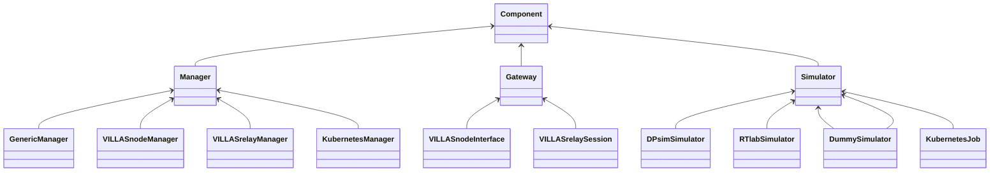

# Protocol {#controller-protocol}

This page documents the data model/protocol used by VILLAScontroller to control and monitor infrastructure components (IC).
The protocol uses AMQP to transport JSON encoded objects which are specified in the following document.

VILLAScontroller is implemented in Python and using the [Kombo messaging package](https://kombu.readthedocs.io).

The Git repository is available at: http://git.rwth-aachen.de/acs/public/villas/controller

The puporse of VILLAScontroller is the orchestration of IC in distributed lab setups.
This includes the following tasks:

- managment: instantiation, deletion & discovery
- monitoring: status?
- control: start, stop, pause, reset, resume, shutdown

## Entities {#controller-protocol-entities}

For the purpose of addressing the ICs, we introduce the following categories (1st level) and types (2nd level): 

- `simulator`
  - `dpsim`
  - `generic`
  - `rtlab`
  - `rtds`
  - `dummy`
  - `job` (a [Kubernetes Job](https://kubernetes.io/docs/concepts/workloads/controllers/job/))
- `gateway`
  - `node`
  - `relay`
- `manager`
  - `node`
  - `relay`
  - `kubernetes`

These component types are implemented by the following class hierachy in VILLAScontroller's Python code:



## Exchange {#controller-protocol-amqp-exchange}

All messages processed by VILLAScontroller are sent via an AMQP `headers` exchange.

The exchange is named `villas`.

## Routing {#controller-protocol-amqp-routing}

The following headers are used to identify and route messages to the receipients:

- `realm` describes the entity which is responsible for operating the equipment.
  The realm should be a fully quallified domain name (FQDN) in reverse order.
  - Examples:
    - `de.rwth-aachen.eonerc.acs`
    - `gov.inl`

- `category` describes the classes of equipment.
  - Examples:
    - `simulator`
	- `manager` (manages ICs, e.g. Kubernetes Jobs, VILLAS WebSocket endpoints)
    - `gateway` (e.g. VILLASnode, e.g. VILLASrelay)

- `type` further defines the type/vendor of a device within its class.
  - For `simulator`:
    - `dummy` (_implemented_)
    - `generic` (_implemented_)
    - `dpsim` (_WIP_)
    - `rtlab` (_planned_)
    - `rscad` (_planned_)
  - For `gateway`:
    - `villas-node` (_implemented_)
    - `villas-relay` (_implemented_)
  - For `controller`:
    - `kubernetes`
    - `villas-controller`
  - For `service`:
	- `ems`
	- `custom`?
  - For `equipment`:
	- `chroma-emulator`
	- `chroma-loads`
	- `sma-sunnyboy`
	- `fleps`
	- `sonnenbatterie`

- `uuid` is a globally unique identifier
  - Examples:
    - `56babc1e-0476-11e8-9375-471525328a77`

Example of an application header:

```json
{
	"realm" : "de.rwth-aachen.eonerc.acs",
	"category" : "simulator",
	"type" : "rtlab",
	"uuid" : "56babc1e-0476-11e8-9375-471525328a77"
}
```

**Important:** Note that at least one of the headers must be provided. Otherwise no component will receive it.

It is also valid to just provide a single header (e.g. `uuid` to address a specific component or `type` to adress a class of components).

## State Machine

@htmlonly
<div class="mermaid">
stateDiagram-v2
    [*] --> State1
    state State1 {
      [*] --> idle
      idle --> starting: start
      starting --> running
      running --> stopping: stop
      stopping --> stopped
      running --> pausing: pause
      pausing --> paused
      paused --> stopping: stop
      paused --> resuming: resume
      resuming --> running
    }
    State1 --> resetting: reset
    resetting --> State1
    State1 --> shuttingdown: shutdown
    shuttingdown --> [*]
    State1 --> error: exception
    error --> resetting: reset
</div>
@endhtmlonly

## Management

### Discovery

In a messaging protocol like AMQP, brokers do not store message contents in a persistant way.
They only temporarily queue messages until they have been delivered.
Therefore, the broker cannot keep track of the state or presence of entitities.

This section describes a simple discovery mechanism to work around this limitation.
Each entity must react on `action = ping` messages and respond immediatly with a status response message.

```json
{
	"action" : "ping"
}
```

After receiving such a message, each entity shall send a status update message as decribed below.

### Status Update

```json
{
	"status" : {
		/* Generic state */
		"state" : "running",
		"version" : "0.1.0",                /* VILLAScontroller version */
		"uptime" : 123124.0,                /* in seconds since initialization (float) */
		"result": "XXXXXXX"                 /* only if state == "running" */
		"error": "This is an error message" /* only if state == "error" */

		/* Custom state (depending on IC type) */
		"villas_node_version": "v0.11.0",
		"kernel": ["Linux", "villas-node-594f8c7bff-wmznc", "5.0.0-29-generic", "#31~18.04.1-Ubuntu SMP Thu Sep 12 18:29:21 UTC 2019", "x86_64"],
		"host": "villas-node-594f8c7bff-wmznc"
	},
	"properties": { /* fixed configuration of IC as provided by user */

		/* Generic properties */
		"name" : "OP5600",
		"description" : "some optional description",
		"location" : "OPAL-RT Rack, ACS Real-time Lab, EONERC, RWTH",
		"owner" : "stvogel@eonerc.rwth-aachen.de",

		"ws_url" : "https://villas-new.k8s.eonerc.rwth-aachen.de/ws/relay/node_1",
		"api_url" : "https://villas-new.k8s.eonerc.rwth-aachen.de/ws/relay/api/node_1",

		/* Custom properties (depending on IC type) */
		"opal_hostname": "opal-op5600.acs-lab.eonerc.rwth-aachen.de"
	},
	"when" : 1234567890 /* timestamp in seconds (UTC / Unix epoch / since 1970-01-01) (float) */
}
```

Used values for `state`:

- `gone` (issued once after `action = delete`)
- `error`
- `idle`
- `starting`
- `running`
- `pausing`
- `paused`
- `resuming`
- `stopping`
- `resetting`
- `shuttingdown`
- `shutdown`

## Management

### Creation of new components

**Important:** This action type must be directed at a component of category `manager`!

```json
{
	"action": "create",
	"when": 1234567890,
	"parameters": {
		"name": "DPsim simulator",
		"location": "ACS lab",
		"realm": "de.rwth-aachen.eonerc.acs",
		"category": "simulator",
		"type": "dpsim"
		"uuid": "c487a470-6af6-11eb-beee-7fa268050404"
	}
}
```

The `uuid` parameter is optional. If not provided, the managing component will generate a random one.

### Deletion of components

**Important:** This action type must be directed at a component of category `manager`!

```json
{
	"action": "delete",
	"parameters": {
		"uuid": "c487a470-6af6-11eb-beee-7fa268050404"
	}
	"when": 1234567890,
}
```

## Control

### Reset

```json
{
	"action" : "reset",
	"when" : 1234567890
}
```

### Shutdown

```json
{
	"action" : "shutdown",
	"when" : 1234567890
}
```

### Start

Start the simulation at a specific point in time.

```json
{
	"action" : "start",
	"parameters" : {
	    "timestep" : 50e-6,
	    "duration" : 10,
	    "domain" : "dp",
	    "downsample" : 1
	},
	"model" : { // HTTP GET for model download
		"type": "url-list",
		"url" : [
			"https://villas.k8s.eonerc.rwth-aachen.de/api/v2/files/123421",
			"https://villas.k8s.eonerc.rwth-aachen.de/api/v2/files/123422"
		],
		"token": "Xwlsjkdlfksjhdfglskdfg"
	},
	"results" : { // HTTP POST for results upload
	    "type" : "url"
	    "url" : "https://villas.k8s.eonerc.rwth-aachen.de/api/v2/runs/3452345234/results"
		"token": "Xwlsjkdlfksjhdfglskdfg"
	},
	"when" : 1234567890
}
```

Another example for `type = generic`:

```json
{
	"action" : "start",
    "parameters" : {
        "executable" : "ping",
        "argv" : [
            "google.de",
            "-c", "10"
        ],
        "working_directory" : "/tmp/simulationX",
        "shell" : false,
        "environemnt" : [
            "DEBUG" : "1"
        ]
    },
	"when" : 1234567890
}
```

### Stop

Stop the simulation at a specific point in time.

```json
{
	"action" : "stop",
	"when" : 1234567890
}
```

### Pause

Pause the simulation at a specific point in time.

```json
{
	"action" : "pause",
	"when" : 1234567890
}
```

### Resume

Resume the simulation at a specific point in time.

```json
{
	"action" : "resume",
	"when" : 1234567890
}
```
