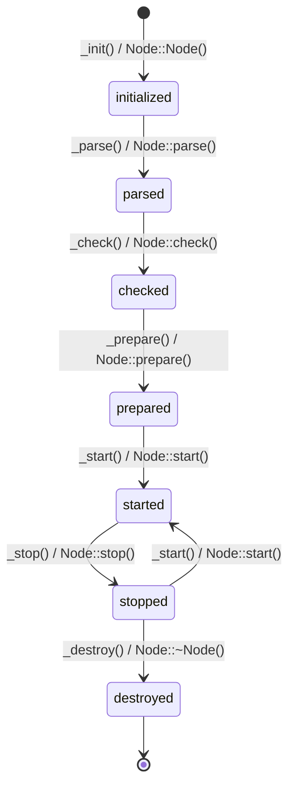

# Development

Development is currently coordinated by Steffen Vogel <post@steffenvogel.de> at [VILLASframework GitHub organization](https://github.com/VILLASframework/node).
Please feel free to submit pull requests or bug reports.

A [contribution guide](https://github.com/VILLASframework/node/blob/master/CONTRIBUTING.md) is available in the [Git repository](https://github.com/VILLASframework/node).

## Programming Paradigm

VILLASnode is currently written in C/C++ using the ISO C11 and C++17 standards while following an object oriented programming paradigm.

Main _classes_ in VILLASnode are:
- [`struct villas::node::Sample`](https://github.com/VILLASframework/node/blob/master/include/villas/sample.hpp)
- [`class villas::node::Node`](https://github.com/VILLASframework/node/blob/master/include/villas/node.hpp)
- [`class villas::node::Path`](https://github.com/VILLASframework/node/blob/master/include/villas/path.hpp)
- [`class villas::node::Hook`](https://github.com/VILLASframework/node/blob/master/include/villas/hook.hpp)

In order to track the life cycle of those objects, each of them has an `enum State` member.
The following figure illustrates the normal transition through the states of a `Node` type:

Be aware that, when a fatal error occures `_destroy / Node::~Node()` will be called, no matter the previous state of the node.
Also note that `_read() / Node::read()` and `_write() / Node::write()` are guaranteed to only be called in the `started` state.
Please rely on the guaranteed state transition order and do **not** replicate these state transitions within your node type's implementation.

## Shared library: `libvillas.so`

VILLASnode is split into a shared library called libvillas and a couple of executables (`villas-node`, `villas-pipe`, `villas-test`, `villas-signal`, ...) which are linked against this library.

## Plugins {#node-plugins}

There are many places where VILLASnode can easily extended with additional functionality via plugins:

- [Nodes](../nodes/index.md)
- [Formats](../formats/index.md)
- [Hooks](../hooks/index.md)
- [API Endpoints](./api.md)
