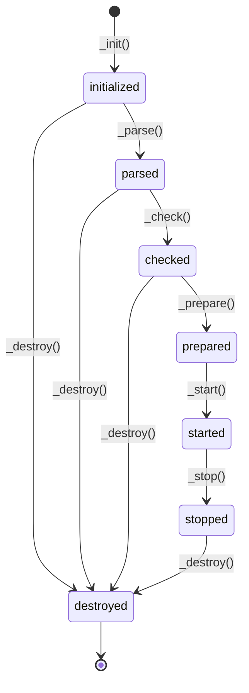

# Development {#node-dev}

Development is currently coordinated by Steffen Vogel <stvogel@eonerc.rwth-aachen.de> using [GitLab](http://git.rwth-aachen.de/acs/public/villas/node).
Please feel free to submit pull requests or bug reports.

A [contribution guide](https://git.rwth-aachen.de/acs/public/villas/node/blob/master/CONTRIBUTING.md) is available in the [Git repository](https://git.rwth-aachen.de/acs/public/villas/node/).

## Programming Paradigm

VILLASnode is currently written in C/C++ using the ISO C11 and C++14 standards while following an object oriented programming paradigm.

Main _classes_ in VILLASnode are `struct sample`, `struct vnode`, `struct vpath` and `class villas::node::Hook`.
In order to track the life cycle of those objects, each of them has an `enum State` member.
The following figure illustrates the state machine which is used:

## Shared library: libvillas

VILLASnode is split into a shared library called libvillas and a couple of executables (`villas-node`, `villas-pipe`, `villas-test`, `villas-signal`, ...) which are linked against this library.

## Plugins {#node-plugins}

There are many places where VILLASnode can easily extended with plugins.
All node, formats-types and hooks are implemented via plugins.
