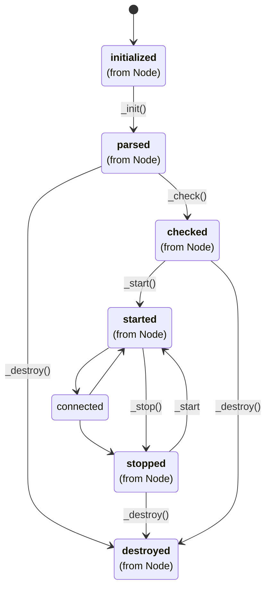

# Infiniband

The `infiniband` node-type implements node communication over the [Infiniband standard](http://www.infinibandta.org/content/pages.php?pg=about_us_infiniband).

# Prerequisites

This node-type requires [libibverbs](https://github.com/linux-rdma/rdma-core) (>= 16.2) and [librdmacm](https://github.com/linux-rdma/rdma-core) (>= 16.2).

# Implementation

The source code of the node-type is available here:
https://github.com/VILLASframework/node/blob/master/lib/nodes/infiniband.cpp

## Configuration {#config}

Every `infiniband` node can be configured to only read or write or to do both at the same time. The node configuration is divided into two sub-groups: `in` and `out`.

import ApiSchema from '@theme/ApiSchema';

<ApiSchema id="node" example pointer="#/components/schemas/infiniband" />

## Example

``` url="external/node/etc/examples/nodes/infiniband.conf" title="node/etc/examples/nodes/infiniband.conf"
nodes = {
    results = {
        type = "file"

        uri = "logs/ib_results-%Y%m%d_%H-%M-%S.log"
    }

    siggen = {
        type = "signal"

        signal = "mixed"
        values = 3
        frequency = 3.0
        rate = 100000.0
        limit = 100000
    }

    ib_node_source = {
        type = "infiniband"

        rdma_port_space = "RC"

        in = {
            address = "10.0.0.2:1337"

            max_wrs = 8192
            cq_size = 8192

            vectorize = 1

            buffer_subtraction = 128
        }

        out = {
            address = "10.0.0.1:1337"
            resolution_timeout = 1000

            max_wrs = 8192
            cq_size = 256

            vectorize = 1

            send_inline = true
            max_inline_data = 60

            use_fallback = true
        }
    }

    ib_node_target = {
        type = "infiniband"

        rdma_port_space = "RC"

        in = {
            address = "10.0.0.1:1337"

            max_wrs = 8192
            cq_size = 8192

            vectorize = 1

            buffer_subtraction = 128

            hooks = (
                { type = "stats", verbose = true }
            )
        }
    }
}
```

## State diagram


